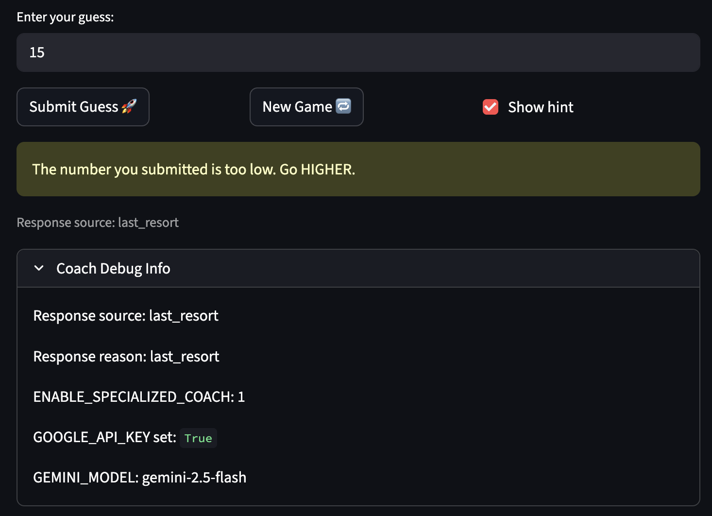
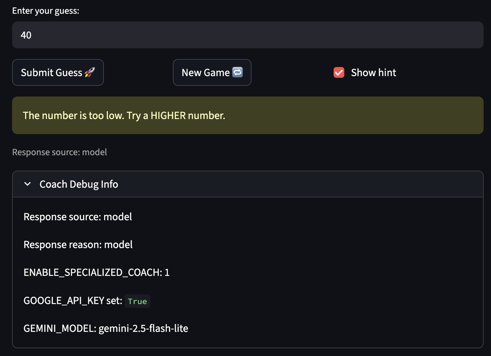

# 🎮 AI-Powered Game Glitch Investigator

The original goal of this project was to create a number guessing game. In Module 1, I learned how to use an AI tool to debug the game, which had a number of errors. I then used that AI tool to fix the errors. 

## Title and Summary

- Title: AI-Powered Game Glitch Investigator
- Summary: I fixed the guessing game’s state and logic bugs, moved the core game rules into reusable helper functions, and added an AI coach that can generate smarter hints. This work makes the game more reliable, easier to test, and easier to maintain as new features are added. It also improves the player's experience by giving clearer feedback and making the hints feel more responsive and helpful.

## Architecture Overview

The diagram, which is located in the assets folder, shows the game starting with user input in `app.py`. Then, Streamlit collects the guess and difficulty, then sends the guess into `logic_utils.py` to be parsed. The outcome is then checked and the game determines whether the guess was too high, too low, or correct. `ai_coach.py` uses that outcome and the current game context to generate a short hint. The coach first tries the Gemini API, but if that call fails or is unavailable, it falls back to deterministic rules so the game still returns a useful response. The testing layer in `tests/` checks the coach behavior, guardrails, and logic helpers so the AI messaging stays safe, consistent, and predictable.

## Setup Instructions

1. Clone the repository and open it in VS Code or your preferred editor.
2. Create and activate a virtual environment.
3. Install the dependencies with `pip install -r requirements.txt`.
4. Start the app with `streamlit run app.py`.
5. Run the tests with `pytest` to verify the game logic and AI coach behavior.

## Sample Interactions

## Design Decisions

I separated the core guessing rules into `logic_utils.py` so the app stays easier to read, easier to test, and easier to change without touching the Streamlit UI. I also built the AI coach with a deterministic fallback because the game should still work even if the Gemini API is unavailable or returns an unsafe response. The trade-off is that the AI hint system is a little more complex, but that complexity gives me better reliability, clearer guardrails, and a more flexible user experience.

## AI Testing Approach

I test the AI coach in two layers: deterministic tests in `tests/test_ai_coach.py` and mocked API-integration tests in `tests/test_gemini_integration.py`. I also keep an optional live Gemini test behind environment flags (`RUN_LIVE_GEMINI_TESTS=1`, `ENABLE_SPECIALIZED_COACH=1`, and `GOOGLE_API_KEY`) to validate real-model behavior separately from fast unit tests.

## Testing Summary

16 tests passed and 1 test was skipped (live Gemini test requires environment flags and API context). The deterministic game-logic and AI-coach tests now consistently return the correct higher/lower direction, including cases where the first model response is reversed. Accuracy improved after adding outcome-specific prompt constraints and a direction-correction retry before fallback.

## Reflection

This project showed how AI can be useful for both fixing bugs and improving the player experience, but only when its output is carefully constrained. I also learned that the AI prompt and guardrails must go through several iterations of testing in order to get the ideal result. Moving the logic out of the interface made the codebase more maintainable and gave me a clean place to test the game rules. It also reinforced that AI features need guardrails and fallback paths so the app remains dependable for users.